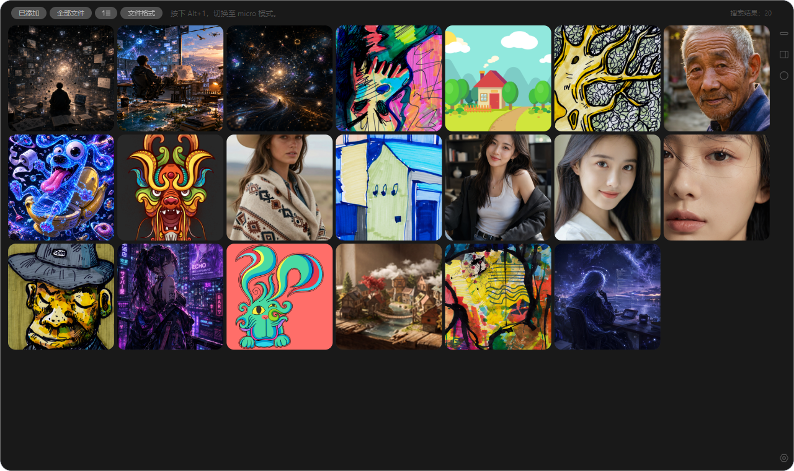
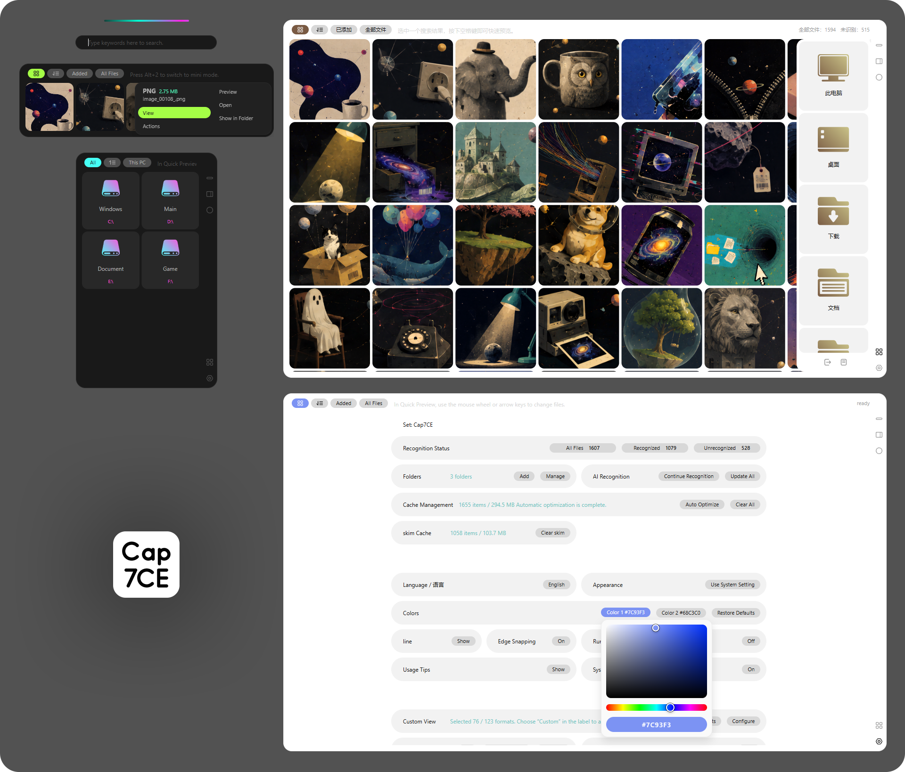
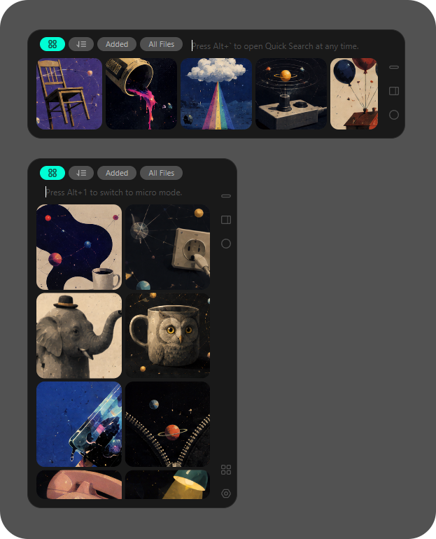
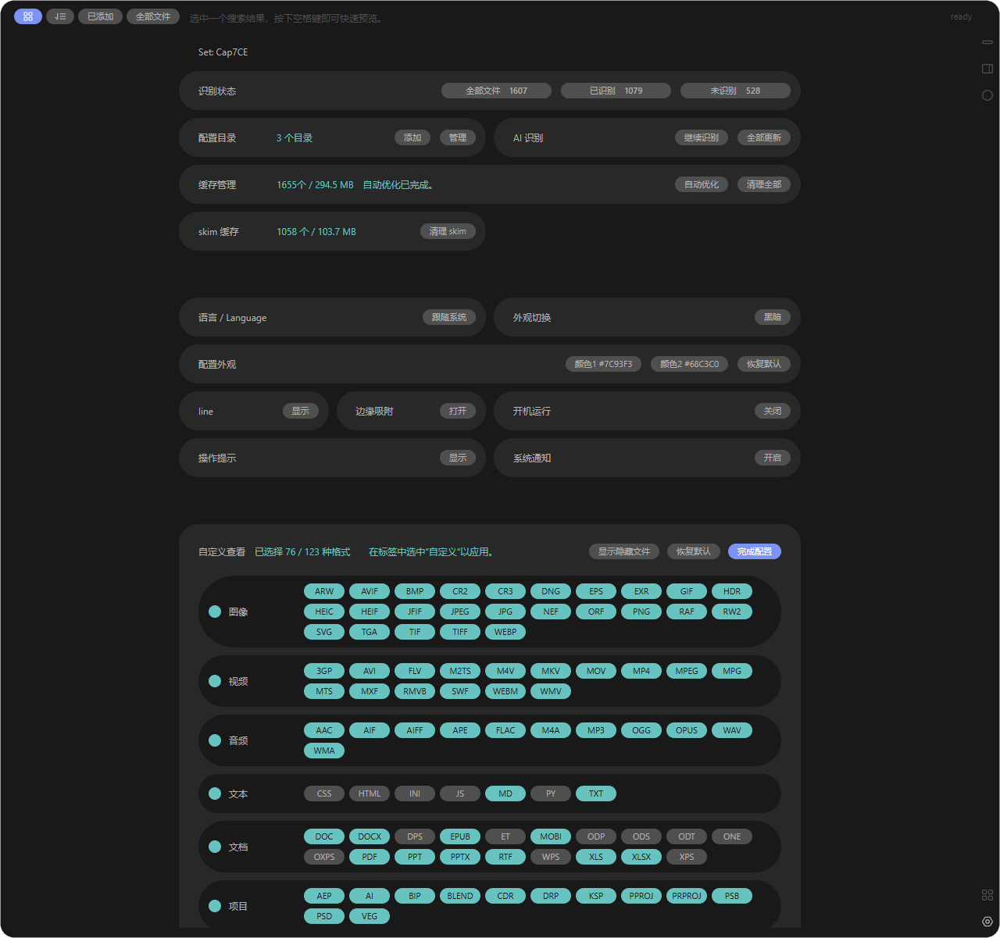

# Cap7CE

[中文](#中文) · [English](#english)

> **Preview software.** Cap7CE is under active development. Back up important files before using file-management features.



## 界面预览 / Interface preview

### 窗口形态 / Window forms



### 紧凑模式 / Compact modes

<p align="center">
  
</p>

### 设置界面 / Settings



截图中的演示素材来源见 [截图素材说明](docs/assets/screenshots/ASSET_SOURCES.md)。
See [Screenshot asset sources](docs/assets/screenshots/ASSET_SOURCES.md) for the origin of the demo artwork.

## 中文

Cap7CE 是一款面向 Windows 的本地视觉文件搜索工具。它扫描用户主动添加的目录，使用本地 `llama.cpp` 视觉模型生成描述与关键词索引，并提供缩略图搜索、筛选、预览和基础文件管理能力。

源文件、索引、缓存、模型和运行时配置均保留在本机。Cap7CE 不提供模型或 `llama.cpp`，也不会将素材上传到远程识别服务。

### 当前状态

- 当前版本：`0.8.0`
- 发布阶段：Preview
- 支持平台：Windows 10 / 11 x64
- 当前主要测试环境：Windows 11、NVIDIA CUDA 版 `llama.cpp`
- 代码许可证：GPL-3.0-only

Preview 版本仍可能存在兼容性、性能和界面问题。首次公开安装包可能未经代码签名，并可能触发 Windows SmartScreen 提示。

### 主要功能

- 扫描多个本地目录并建立文件索引。
- 通过本地视觉模型生成描述与关键词。
- 新执行的 AI 识别会跟随当前软件语言生成中文或英文描述与关键词。
- 按关键词、文件名、目录、识别状态、格式和排序方式筛选。
- 使用 skim 浏览磁盘和目录中的多种项目文件，并快速预览视觉、文本、音频和视频内容。
- 提供 capsule、micro、mini、normal 和 Settings 窗口形态。
- 支持缩略图、独立预览窗口、多选和关键词编辑。
- 支持打开文件、定位路径、拖拽导出和移入回收站。
- 支持明亮、黑暗、跟随系统主题及中英文界面。
- 支持可配置全局快捷动作和冒号语法快捷指令。
- 管理缩略图、预览图和模型输入图三类本地视觉缓存。

### 支持的文件格式

`JPG`、`JPEG`、`PNG`、`WEBP`、`BMP`、`TIF`、`TIFF`、`GIF`、`SVG`、`PDF`、`PSD`、`AI`、`EPS`、`CDR`

多页或复杂文档当前通常使用第一页、合成图或内置预览图作为代表图。部分旧格式、特殊编码或缺少内置预览的文件可能无法渲染。

### 运行前准备

Cap7CE 本体可以在缺少 AI 运行时的情况下浏览和搜索文件名。执行 AI 识别还需要：

1. 与本机硬件匹配的 Windows 版 `llama.cpp`，其中必须包含 `llama-server.exe`。
2. 支持视觉输入的 GGUF 主模型。
3. 与主模型匹配的 `mmproj` GGUF 文件。

推荐目录结构：

```text
Cap7CE/
├─ Cap7CE.exe
├─ llama.cpp/
│  ├─ bxxxx-cuda/
│  │  ├─ llama-server.exe
│  │  └─ ...
│  └─ other-version/
│     ├─ llama-server.exe
│     └─ ...
└─ models/
   ├─ vision-model.gguf
   └─ mmproj-vision-model.gguf
```

每个 `llama.cpp` 版本使用独立子目录。`models` 可以包含子目录；Cap7CE 会递归扫描 `.gguf` 文件，并尝试将主模型与 `mmproj` 配对。

官方多文件压缩包已预先创建空的 `llama.cpp` 与 `models` 目录；软件仍不内置运行时或模型文件。

运行时和模型必须由用户从其官方或可信来源单独获取，并遵守各自的许可证与使用条款。Cap7CE 项目不为第三方运行时或模型提供再分发授权。

当前 Qwen3-VL 4B Q4 开发配置建议使用具备至少 8 GB 显存的 NVIDIA GPU；16 GB 显存可为模型和上下文提供更多余量。CPU-only、其他 GPU 后端和更大模型的速度及显存需求取决于所选 `llama.cpp` 构建，尚未完成全面验证。

#### 已验证的推荐模型

在当前完成测试的视觉模型中，`Qwen3-VL-4B-Instruct` 是与 Cap7CE 适配效果最好的推荐模型。Qwen 团队提供[上游原始模型](https://huggingface.co/Qwen/Qwen3-VL-4B-Instruct)；Cap7CE 当前实际验证的是 Unsloth 发布的第三方 GGUF 量化版本：

- 主模型：[Qwen3-VL-4B-Instruct-Q4_K_M.gguf](https://huggingface.co/unsloth/Qwen3-VL-4B-Instruct-GGUF/blob/main/Qwen3-VL-4B-Instruct-Q4_K_M.gguf)
- 视觉投影文件：[mmproj-F16.gguf](https://huggingface.co/unsloth/Qwen3-VL-4B-Instruct-GGUF/blob/main/mmproj-F16.gguf)
- 完整仓库：[unsloth/Qwen3-VL-4B-Instruct-GGUF](https://huggingface.co/unsloth/Qwen3-VL-4B-Instruct-GGUF)

必须同时下载主模型和 `mmproj-F16.gguf`。只有主模型时，Cap7CE 会将该视觉模型标记为未配对，无法执行图像识别。建议把两个文件放在 `models` 下的同一个目录中，例如：

```text
models/
└─ Qwen3-VL-4B-Instruct/
   ├─ Qwen3-VL-4B-Instruct-Q4_K_M.gguf
   └─ mmproj-F16.gguf
```

该 GGUF 仓库由 Unsloth 而非 Qwen 团队发布，并标记为 Apache-2.0。下载和使用前仍应阅读模型仓库及上游模型卡；Cap7CE 不镜像、不修改也不随安装包分发这些文件。

### 从源码运行

开发环境需要：

- Windows 10 / 11 x64
- Node.js 20.16 或更新版本
- npm
- Git

```powershell
git clone https://github.com/7C93F3-L/Cap7CE.git
cd Cap7CE
npm ci
npm run dev
```

### 构建与验证

```powershell
npm run build
npm test
npm run pack
npm run dist
```

| 命令 | 用途 |
| --- | --- |
| `npm run dev` | 启动 Vite 与 Electron 开发环境 |
| `npm run build` | 构建 Renderer 和 Electron 主进程 |
| `npm test` | 运行仓库内可独立完成的集成测试 |
| `npm run pack` | 生成未安装的应用目录，用于打包检查 |
| `npm run dist` | 生成 Windows x64 portable 构建 |

`npm run build` 通过不代表安装包已经验证。发布前仍需执行打包并进行人工交互测试。

### 本地数据与隐私

- 用户配置、SQLite 索引和视觉缓存默认位于 `%APPDATA%\Cap7CE`。
- Cap7CE 只处理用户主动添加的目录。
- AI 请求发送到本机 `127.0.0.1` 上由 Cap7CE 启动的 `llama-server`。
- 项目当前不包含遥测、分析或云端识别功能。
- 日志和问题报告可能包含本地路径；公开提交前请先移除个人信息。

### 当前限制

- 仅支持 Windows x64。
- 不内置、不自动下载 `llama.cpp` 或视觉模型。
- AI 识别结果取决于模型、量化版本、硬件和提示词，不保证准确。
- 复杂文档格式主要提供代表图预览，不是完整文档编辑器或解析器。
- 当前未对所有 GPU、CPU-only 运行时和 Windows 版本完成兼容性验证。
- Preview 版本的数据结构和行为仍可能变化。

### 文档

- [变更记录](CHANGELOG.md)
- [软件架构](docs/SOFTWARE_ARCHITECTURE.md)
- [界面文案核对表](docs/UI_TEXT_CATALOG.md)
- [安全政策](SECURITY.md)
- [第三方声明](THIRD_PARTY_NOTICES.md)
- [品牌与命名政策](BRAND.md)
- [截图素材说明](docs/assets/screenshots/ASSET_SOURCES.md)

### 参与和反馈

公开仓库启用后：

- 可通过 GitHub Issues 报告可复现问题或提出功能建议。
- 安全漏洞请按照 [SECURITY.md](SECURITY.md) 私下报告。
- 商业使用者可通过 GitHub Discussions 主动告知使用场景。该告知是友好请求，不是 GPL-3.0-only 的附加许可条件。

### 许可证与署名

Cap7CE 源代码以 [GPL-3.0-only](LICENSE) 发布。第三方组件继续适用其各自许可证，详见 [THIRD_PARTY_NOTICES.md](THIRD_PARTY_NOTICES.md)。

Cap7CE 名称、Logo、图标和其他品牌素材不因源代码采用 GPL 而自动获得品牌授权。修改版不得暗示其由官方发布，详见 [BRAND.md](BRAND.md)。

Copyright © 2026 7C93F3-L.

Designed and developed by 7C93F3-L with assistance from Echo using OpenAI Codex.

---

## English

Cap7CE is a local visual-file search tool for Windows. It scans directories explicitly added by the user, generates descriptions and keyword indexes with a local `llama.cpp` vision model, and provides thumbnail search, filtering, preview, and lightweight file-management features.

Source files, indexes, caches, models, and runtime settings remain on the local machine. Cap7CE does not bundle models or `llama.cpp`, and it does not upload media to a remote recognition service.

### Project status

- Current version: `0.8.0`
- Release stage: Preview
- Supported platform: Windows 10 / 11 x64
- Primary test environment: Windows 11 with a CUDA build of `llama.cpp`
- Source-code license: GPL-3.0-only

Preview releases may still contain compatibility, performance, and UI issues. Early public builds may be unsigned and can trigger a Windows SmartScreen warning.

### Features

- Scan and index multiple local directories.
- Generate descriptions and keywords with a local vision model.
- New AI recognition runs generate Chinese or English descriptions and keywords according to the current app language.
- Filter by keywords, file name, directory, recognition status, format, and sort order.
- Use skim to browse project files across disks and folders, with quick previews for visual, text, audio, and video content.
- Use capsule, micro, mini, normal, and Settings window forms.
- Browse thumbnails, open an independent preview window, select multiple files, and edit keywords.
- Open files, reveal paths, drag files to other applications, and move files to the Recycle Bin.
- Use light, dark, or system themes with Chinese and English interfaces.
- Configure global quick actions and colon-syntax quick commands.
- Manage thumbnail, preview, and model-input caches locally.

### Supported formats

`JPG`, `JPEG`, `PNG`, `WEBP`, `BMP`, `TIF`, `TIFF`, `GIF`, `SVG`, `PDF`, `PSD`, `AI`, `EPS`, `CDR`

For multi-page or complex documents, Cap7CE generally uses the first page, a composite image, or an embedded preview as the representative image. Some legacy files, unusual encodings, or files without embedded previews may not render.

### Runtime preparation

Cap7CE can browse files and search file names without an AI runtime. AI recognition additionally requires:

1. A Windows build of `llama.cpp` suitable for the local hardware and containing `llama-server.exe`.
2. A vision-capable GGUF main model.
3. A matching `mmproj` GGUF file.

Recommended layout:

```text
Cap7CE/
├─ Cap7CE.exe
├─ llama.cpp/
│  ├─ bxxxx-cuda/
│  │  ├─ llama-server.exe
│  │  └─ ...
│  └─ other-version/
│     ├─ llama-server.exe
│     └─ ...
└─ models/
   ├─ vision-model.gguf
   └─ mmproj-vision-model.gguf
```

Keep each `llama.cpp` version in a separate subdirectory. The `models` directory may contain nested directories; Cap7CE scans `.gguf` files recursively and attempts to pair each main model with its `mmproj`.

The official multi-file archive includes empty `llama.cpp` and `models` directories. Runtime and model files are still not bundled.

Users must obtain runtimes and models separately from official or otherwise trusted sources and comply with their respective licenses and terms. The Cap7CE project does not grant redistribution rights for third-party runtimes or models.

For the current Qwen3-VL 4B Q4 development configuration, an NVIDIA GPU with at least 8 GB of VRAM is recommended; 16 GB provides additional headroom for the model and context. Performance and memory requirements for CPU-only use, other GPU backends, and larger models depend on the selected `llama.cpp` build and have not been comprehensively validated.

#### Verified recommended model

Among the vision models tested so far, `Qwen3-VL-4B-Instruct` currently provides the best fit for Cap7CE. The Qwen team publishes the [upstream model](https://huggingface.co/Qwen/Qwen3-VL-4B-Instruct); the configuration actually verified with Cap7CE uses third-party GGUF quantization files published by Unsloth:

- Main model: [Qwen3-VL-4B-Instruct-Q4_K_M.gguf](https://huggingface.co/unsloth/Qwen3-VL-4B-Instruct-GGUF/blob/main/Qwen3-VL-4B-Instruct-Q4_K_M.gguf)
- Vision projector: [mmproj-F16.gguf](https://huggingface.co/unsloth/Qwen3-VL-4B-Instruct-GGUF/blob/main/mmproj-F16.gguf)
- Full repository: [unsloth/Qwen3-VL-4B-Instruct-GGUF](https://huggingface.co/unsloth/Qwen3-VL-4B-Instruct-GGUF)

Both the main model and `mmproj-F16.gguf` are required. With only the main model present, Cap7CE marks the vision model as unpaired and cannot perform image recognition. Place both files in the same directory under `models`, for example:

```text
models/
└─ Qwen3-VL-4B-Instruct/
   ├─ Qwen3-VL-4B-Instruct-Q4_K_M.gguf
   └─ mmproj-F16.gguf
```

This GGUF repository is published by Unsloth, not by the Qwen team, and is marked Apache-2.0. Review the quantization repository and upstream model card before downloading or using the files. Cap7CE does not mirror, modify, or distribute them with the application.

### Run from source

Development requirements:

- Windows 10 / 11 x64
- Node.js 20.16 or newer
- npm
- Git

```powershell
git clone https://github.com/7C93F3-L/Cap7CE.git
cd Cap7CE
npm ci
npm run dev
```

### Build and verification

```powershell
npm run build
npm test
npm run pack
npm run dist
```

| Command | Purpose |
| --- | --- |
| `npm run dev` | Start the Vite and Electron development environment |
| `npm run build` | Build the Renderer and Electron main process |
| `npm test` | Run the self-contained integration tests included in the repository |
| `npm run pack` | Generate an unpacked application directory for packaging checks |
| `npm run dist` | Generate a Windows x64 portable build |

A successful `npm run build` does not validate the packaged application. Packaging and manual interaction tests are still required before release.

### Local data and privacy

- Preferences, the SQLite index, and visual caches are stored under `%APPDATA%\Cap7CE` by default.
- Cap7CE processes only directories explicitly added by the user.
- AI requests are sent to the local `llama-server` started by Cap7CE on `127.0.0.1`.
- The project currently contains no telemetry, analytics, or cloud-recognition feature.
- Logs and issue reports may contain local paths; remove personal information before posting them publicly.

### Current limitations

- Windows x64 only.
- `llama.cpp` and vision models are neither bundled nor downloaded automatically.
- Recognition quality depends on the model, quantization, hardware, and prompt and is not guaranteed.
- Complex document formats are represented by preview images; Cap7CE is not a full document editor or parser.
- Not every GPU, CPU-only runtime, or Windows version has been tested.
- Preview data structures and behavior may still change.

### Documentation

- [Changelog](CHANGELOG.md)
- [Software architecture](docs/SOFTWARE_ARCHITECTURE.md)
- [UI text catalog](docs/UI_TEXT_CATALOG.md)
- [Security policy](SECURITY.md)
- [Third-party notices](THIRD_PARTY_NOTICES.md)
- [Brand and naming policy](BRAND.md)
- [Screenshot asset sources](docs/assets/screenshots/ASSET_SOURCES.md)

### Contributing and feedback

After the public repository is enabled:

- Use GitHub Issues for reproducible bugs and feature proposals.
- Report vulnerabilities privately as described in [SECURITY.md](SECURITY.md).
- Commercial users are welcome to describe their use case through GitHub Discussions. This is a friendly request, not an additional condition of GPL-3.0-only.

### License and credits

Cap7CE source code is released under [GPL-3.0-only](LICENSE). Third-party components remain under their respective licenses; see [THIRD_PARTY_NOTICES.md](THIRD_PARTY_NOTICES.md).

The Cap7CE name, logo, icons, and other branding are not automatically licensed as branding merely because the source code is under the GPL. Modified versions must not imply official endorsement; see [BRAND.md](BRAND.md).

Copyright © 2026 7C93F3-L.

Designed and developed by 7C93F3-L with assistance from Echo using OpenAI Codex.
